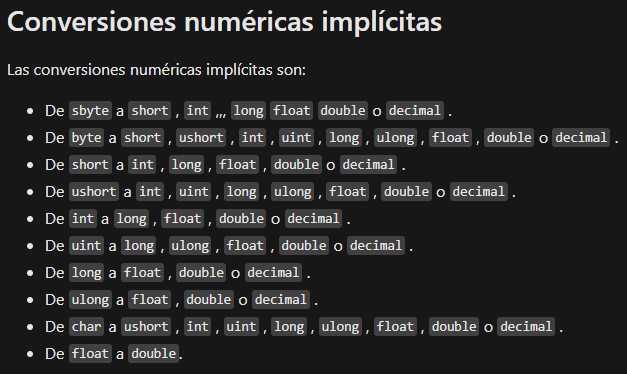
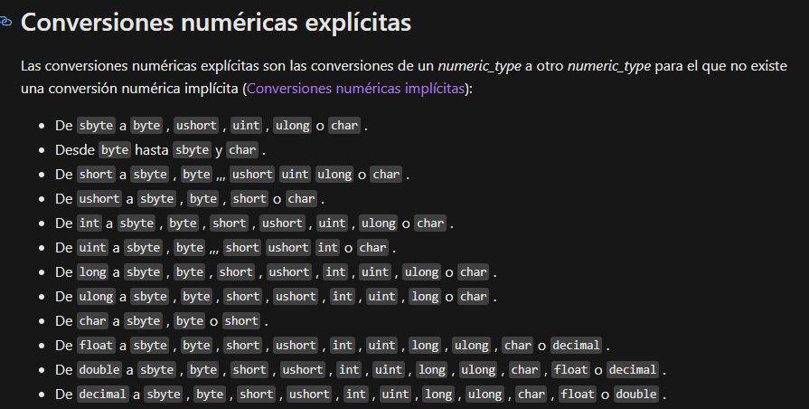

# _**Operadores Aritmeticos Binarios Suma**_

- ### <span style = "color: #c945a1 "> **TABLA DE CONTENIDO** </span>
1. ##### [<span style = "color: #1e666c99 "> **OPERADORES GENERAL** </span>](#que-son)
2. ##### [<span style = "color: #1e776c99 "> **EJEMPLOS OPERADORES** </span>](#sintaxis)
3. ##### [<span style = "color: #1e886c99 "> **SINTAXIS IXPLICITA** </span>](#implicita)
4. ##### [<span style = "color: #1e997c99 ">**SINTAXIS EXPLICITA** </span>](#explicita)
---
 ## **Que Son:** 
>**Los operadores aritmeticos son los que se usan para calcular el valor final de dos o mas cantidades medibles.** > ## **EJEMPLO:**
>>  #### **Los operadores aritmeticos como lo son:**f
>> 1.  Suma   '+'
>> 1.  Resta  '-'
>> 1.  Multiplicacion '*'
>> 1.  Division   '/'
>> 1.  Residuo    '%'

---

## **Sintaxis:**
```cs
using System;

namespace operadores_aritmeticos_binarios_suma
{
    class Program
    {
        static void Main(string[] args)
        {


            Console.WriteLine("\nOperacionesAritmeticas-Binaria-Suma");

            Console.Write("\nIntroduce tu primera cifra: ");
            string string_0 = Console.ReadLine();
            Console.Write("\nIntroduce tu primera cifra: ");
            string string_1 = Console.ReadLine();

            double suma_0 = Convert.ToDouble(string_0);
            double suma_1 = Convert.ToDouble(string_1);
            
            Console.WriteLine($"\nLa suma de {string_0} + {string_1} = {suma_0 + suma_1}");

        }
    }
}
```
> Donde la suma de estos puede realizarse de manera directa al ser impreso usando " **{}** " y " **$** " para determinar que la variable declarada dentro de las comillas como una cadena de caracteres o numeros, la posicion de el simbolo " $ " debe ser fuera de las comillas de impresion para que detecte varibles.

## **Uso de conversion de varibles:** 

> Existen dos tipos de medios de conversion, explicita e implicita:
---
## **IMPLICITA:**
[](https://docs.microsoft.com/es-es/dotnet/api/system.convert?view=netcore-3.1)
>### **Sintaxis:**
>```cs
> double myDoble = 9.78;
> int myInt = (int) myDouble;
> 
> Console.Writeline(myDouble);
> Console.Writeline(myInt);

## **EXPLICITA:**
[](https://docs.microsoft.com/es-es/dotnet/api/system.convert?view=netcore-3.1)
>### **Sintaxis:**
>```cs
> int myInt = 10;
> double myDoble = 5.25;
> bool myBool = true:
> 
> Console.Writeline(Convert.ToString(myInt));
> Console.Writeline(Convert.ToDouble(myInt));
> Console.Writeline(Convert.ToInt32(myDouble));
> Console.Writeline(Convert.ToString(myBool));

> - _Como punto importante cabe recalcar que cada uno usa su propia forma de coversion al igual que direccion de conversion en sus unidades como ultimo punto **Siempre se deben serguir las tablas o la informacion adjunta en las imagenes del el sitio docs ---> [Conversion de unidades](https://docs.microsoft.com/es-es/dotnet/api/system.convert?view=netcore-3.1)**_  

---

- <span style = "color: #c945a1 "> _**BY AGGDEBNAM**_ </span>
